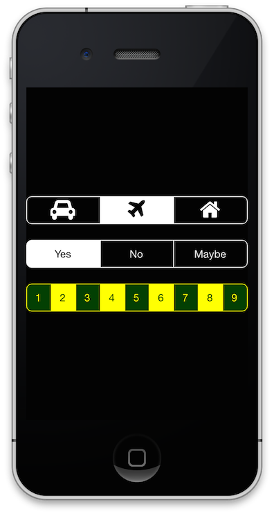

MWButtonGroup
=============

A UIView containing a group of buttons horizontally positioned in a rounded rectangle. 

* Support for single-select mode and multi-select mode is available.
* Colouring and limited styling of the buttons is possible
* Notifications are handled by a delegate pattern



## Requirements

`MWButtonGroup` was written for ARC and requires iOS 7.0+ (but it should also work on earlier versions). No other dependencies are currently needed.

### Installation

`MWButtonGroup` is best installed using CococaPods (see http://cocoapods.org).

Add the following line to your Podfile:

```ruby
pod 'MWButtonGroup' , :git=> 'https://github.com/zliw/MWButtonGroup.git'
```

## Usage

An example of the usage can be seen in the ```MWButtonGroup-Example```-Folder.

### The Basics

The view can be initialized like any other UIView subclass (or can be created in interface builder). Unfortunately styling of the view has to be implented in code.

```objective-c
  MWButtonGroup *group = [[MWButtonGroup alloc] initWithFrame:CGRectMake(0, 0, 320, 40)];
```

Buttons can be added by specifying their labels as strings:

```objective-c
  [group createButtonsForTitles:@[@"Yes", @"No", @"Maybe"]]
```

Multiselection is turned off by default. You can enable it by setting a property.

```objective-c
    group.coloredButtonGroup.multiSelectAllowed = YES;
```

The default is to use black and white as colour scheme. You can set the following colour
properties.

```objective-c
    group.textColor = [UIColor yellowColor];
    group.buttonBackgroundColor = [UIColor colorWithRed:0 green:0.25 blue:0 alpha:1];
```

The font can be set for all buttons contained in the button group:

```objective-c
    group.font = [UIFont fontWithName:@"HelveticaNeue" size:16];
```

## License

The component is available under a MIT license. For more details see the [license](https://github.com/zliw/MWButtonGroup/blob/master/LICENSE) file.

